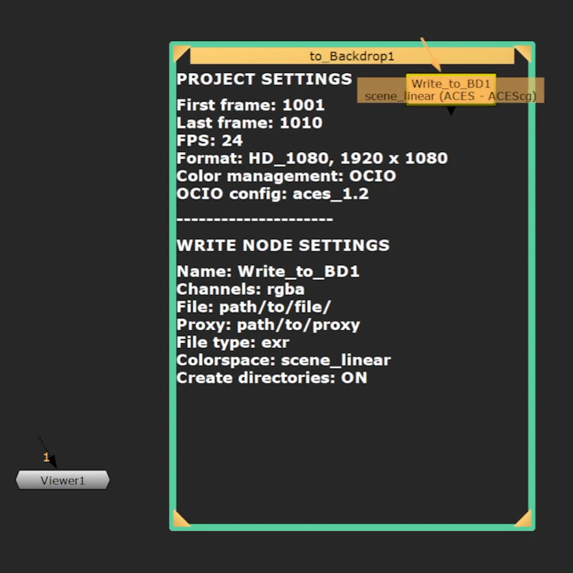

# Write to BD Tools

English / [Japanese](./README_ja.md) 

  

## Overview
This tool displays Write node and Project settings in a Backdrop node, 
so artists can check their render setup in seconds — no digging through properties needed.  

## Table of Contents
- [Demo](#Demo)
- [Compatibility](#Compatibility)
- [Download](#Download)
- [Installation](#installation)
- [Description](#description)
- [References](#References)
- [Acknowledgements](#Acknowledgements)
- [Tools](#Tools)
- [Contact](#contact)
- [License](#license)

## Demo
Check out a quick guide on how to use the tool: [Watch the Tool Demo](https://youtu.be/JPRIZQytD1I)

## Compatibility
Tested in NukeX, Nuke Indie 15.1v2 on Windows.  
Likely compatible with other Nuke 15+ versions (Python 3).

## Download
[Click here for the latest release](https://github.com/AtsuMatsui/Write-to-BD-Tools/releases/tag/Write-to-BD-v1.0.0)

## Installation
1. Place the `write_to_BD_tools` folder into your `.nuke` directory.

2. Open the `init.py` file in the `.nuke` directory, add the following line, 
   and save the file:  
`nuke.pluginAddPath('./write_to_BD_tools')`

3. Open a new Nuke project, and you will see a new tool added 
   to your "Node" toolbar.

## Description

### How to Use
  
1. Click the icon on the "Node" toolbar or right-click in the Node Graph 
to import "Write to BD with TCL".  
Two nodes will appear:  
   - Write node named `Write_to_BD1`  
   - Backdrop node named `to_Backdrop1` (with a label written in TCL)
2. Just like a regular Write node, place it where you want to render.
3. As you adjust the Write node settings and play a few frames in the Viewer, 
the Backdrop node label will update to the current Write node and Project settings.
  
**Note**:  
Due to Nuke's default behavior, you may need to check and uncheck the lock range
 in Project settings to refresh the values in frame range.  

**Using a Write Node Other Than Default**:
1. Delete the default "Write_to_BD1" node.
2. Copy the name of the Write node you want to use.
3. In the Backdrop node label, locate this line of TCL code:  
`Name: [set write_node Write_to_BD1]`
4. Replace `Write_to_BD1` with your current Write node name.

#### Use Cases:  
-  Check your own settings to ensure everything is ready for rendering — no hassle.
-  Check multiple Write nodes' settings during pre-render or proxy setup.
-  Review render setups created by colleagues.

#### Additional Features:

-  "Duplicate & Update" button is available to apply the duplicated node’s name
 and settings to the Backdrop.  
   - It updates the number in the Write node name displayed in the Backdrop label.  
`e.g. Write_to_BD1 → Write_to_BD2`
-  Choose from 8 node color presets.
-  Select font color: white or black.
-  Change Backdrop node appearance: Border or Fill.  

#### Logging:
- Logs error messages when issues arise, helping users quickly identify problems.
- Logs are written to a log file in **JSON format**, making debugging easier
and allowing for easy integration with log analysis tools.
- Logs are automatically saved in log files for up to the past 7 days.
- Removes consecutive log messages to reduce noise in log files.  

#### Example Log File
`.nuke/write_to_BD_tools/logs/error.log.2025-04-16`
<pre> {"timestamp": "2025-04-16 11:04:33", "level": "ERROR", "location": "write_to_bd_log.py:L63", "message": "Node \"Write_to_BD1\" not found"} </pre>

## References
1. Alex Villabon, *Dynamic Backdrops and Sticky Notes* – [YouTube](https://www.youtube.com/watch?v=ru5AY71jfKM&t=0s)
2. Attila Gasparetz, [BACKDROP ADJUST - Nuke Tutorial](https://www.gatimedia.co.uk/backdrop-adjust)
3. Hiram Gifford, [Make a Toggleable Button With Python](https://www.hiramgifford.com/nuke-compositing-tips-and-tricks/nuke-toggleable-button-python)

## Acknowledgements
Special thanks to my instructor **Simon Jokuschies** 
at Rebelway for his support and guidance. I’d also like to thank **Alex Villabon**, 
whose video "Dynamic Backdrops and Sticky Notes" inspired the core idea behind this tool
and the motivation to experiment and refine the tool.

## Tools
<u>These are the tools I used during development.</u>

| Tool         | Version     | Purpose                                      |
|--------------|-------------|----------------------------------------------|
| NukeX & Nuke Indie | 15.1v2      | Building and testing the tool                |
| Python       | v3.10       | Scripting                                    |
| TCL          | —           | Display settings in Backdrop label           |
| PyCharm      | v2024.3     | Development and debugging                    |
| ChatGPT      | —           | Brainstorming, debugging and formatting docs |

## Contact
If you have any questions, feedback, or ideas, feel free to contact me 
on Nukepedia or Email.  
Thank you for using Write_to_BD Tools!

###

Author: Atsu Matsui

Email: [contact@atsumatsui.com](mailto:contact@atsumatsui.com)

X (Twitter): https://x.com/Achi_LIG105

## License
This project is licensed under the MIT License - see the [LICENSE](LICENSE) file for details.
