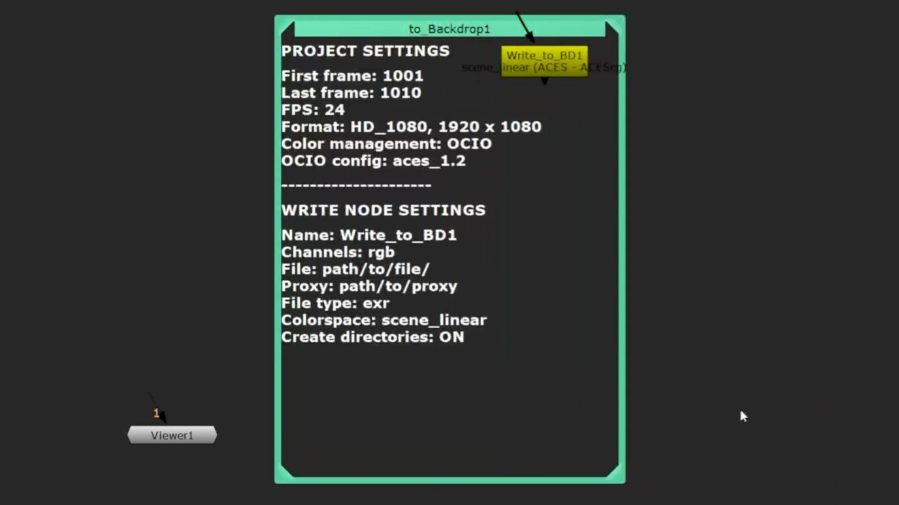
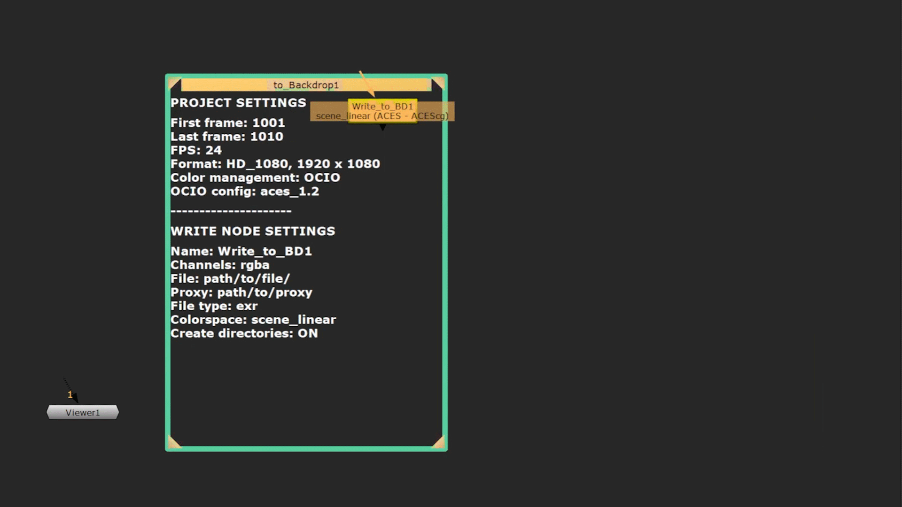
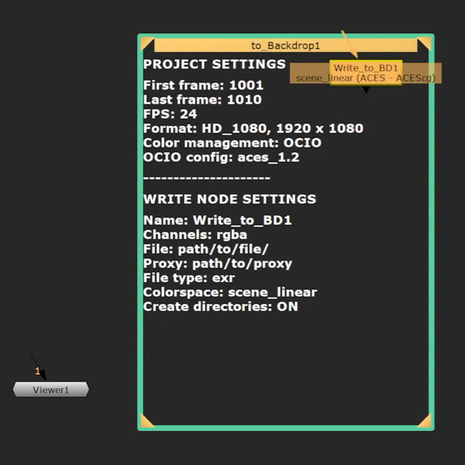

# Write to BD Tools

[English](./README.md) / Japanese

  

## 概要  
Write to BD Toolsは Write ノードの設定とプロジェクト設定を Backdrop ノード上で確認できるツールです。
プロパティを開かなくても、一目で設定を確認できます。

## 目次  
- [デモ動画](#デモ動画)
- [ダウンロード](#ダウンロード) 
- [インストール方法](#インストール方法)  
- [使用方法](#使用方法)  
- [参考URL](#参考URL)
- [謝辞](#謝辞)
- [使用ツール](#使用ツール)  
- [お問い合わせ](#お問い合わせ)  
- [ライセンス](#ライセンス)

## デモ動画
ツールの使い方についてはこちらの動画をご覧ください：[デモ動画を見る](https://youtu.be/JPRIZQytD1I)

## ダウンロード
[最新のリリースはこちら](https://github.com/AtsuMatsui/Write-to-BD-Tools/releases/tag/Write-to-BD-v1.0.0)

## インストール方法
1. `write_to_BD_tools` フォルダを `.nuke` ディレクトリに配置します。  
2. `.nuke` ディレクトリ内の `init.py` ファイルを開き、以下の行を追加して保存：  
   `nuke.pluginAddPath('./write_to_BD_tools')`  
3. 新規Nukeプロジェクトを開くと、「Node」ツールバーにアイコンが追加されます。

## 使用方法
1. 「Node」ツールバーのアイコンをクリックするか、Node Graph 上で右クリックして「Write to BD with TCL」を読み込みます。  
   以下の 2 つのノードが表示されます：  
   - `Write_to_BD1`（Write ノード）  
   - `to_Backdrop1`（TCL スクリプトが書かれている Backdrop ノード）
2. 通常の Write ノードのように、書き出したい箇所にノードを配置します。
3. Write ノードで書き出し設定を行った後、Viewer で数フレーム再生して止めます。すると、Backdrop ノードに設定した情報が表示されます。  

### 補足:  
Nuke の仕様上、フレーム範囲の情報がBackdropノードに更新されない場合があります。 
その際にはプロジェクト設定で「Lock range」のチェックを一度外したり、つけたりしてから再生すると、更新できます。

### Nukeで使用している Write ノードを使いたい場合:  
1. `Write_to_BD1` ノードを削除します。
2. 使用したい Write ノードの名前をコピーします。
3. Backdrop ノードの Node タブにある Label へ以下の TCL コードを探します：  
   `Name: [set write_node Write_to_BD1]`
4. `Write_to_BD1` を使用したいノード名（例：Write1）に置き換えます。  

### 使用例： 
- 自分で書き出し設定とプロジェクト設定を確認したいとき。  
- プリレンダリングやプロキシ作成で複数の Write ノードの設定を確認したいとき。
- 他のアーティストによる設定を確認したいとき。

### その他の機能：
- 複製したノードの名前や設定をBackdropへ反映するボタン「Duplicate & Update」を用意。
   - Backdrop の Label に表示された Write ノード名の番号を更新します。  
`例：Write_to_BD1 → Write_to_BD2`
- 8 種類のノードカラーから色を選択可能です。
- フォントカラーは白または黒を選択可能です。
- Backdrop の見た目を Border（枠線）または Fill（枠内を埋める）のどちらかを選べます。

### ロギング機能:  
- エラー発生時にメッセージをログ出力し、問題の原因を特定します。  
- ログファイルは**JSON形式**で保存されます。デバッグやログ分析ツールとの連携ができるようにしています。 
- 最大で過去7日分までのログファイルを自動的に保存するように設計しています。
- 同じエラーメッセージが繰り返される場合はそれを抑制し、ログを読みやすくしています。  

####  ログファイル例
`.nuke/write_to_BD_tools/logs/error.log.2025-04-16`
<pre> {"timestamp": "2025-04-16 11:04:33", "level": "ERROR", "location": "write_to_bd_log.py:L63", "message": "Node \"Write_to_BD1\" not found"} </pre>

## 参考URL
1. Alex Villabon, *Dynamic Backdrops and Sticky Notes* – [YouTube](https://www.youtube.com/watch?v=ru5AY71jfKM&t=0s)
2. Attila Gasparetz, [BACKDROP ADJUST - Nuke Tutorial](https://www.gatimedia.co.uk/backdrop-adjust)
3. Hiram Gifford, [Make a Toggleable Button With Python](https://www.hiramgifford.com/nuke-compositing-tips-and-tricks/nuke-toggleable-button-python)

## 謝辞
オンラインVFXスクール「Rebelway」の講師 **Simon Jokuschies** 氏からご指導いただき、本ツールを開発いたしました。
また、**Alex Villabon** 氏による「Dynamic Backdrops and Sticky Notes」動画からアイデアを得て、
本ツールを制作することができました。お二人に心より感謝いたします。

## 使用ツール
<u>開発に使用した主なツール一覧：</u>

| ツール | バージョン | 用途 |
|--------------|--------------|--------------|
| NukeX & Nuke Indie | 15.1v2      | ツールの構築とテスト |
| Python       | v3.10       | スクリプト作成 |
| TCL          | —           | Backdropノードのラベルに設定を表示 |
| PyCharm      | v2024.3     | 開発およびデバッグ |
| ChatGPT      | —           | アイデア出し、デバッグ、ドキュメントの整形 |

## お問い合わせ
ご質問・ご意見などがありましたら、NukepediaまたはEmailにてお気軽にご連絡ください。
###
著者: 松井熱

Email: [contact@atsumatsui.com](mailto:contact@atsumatsui.com)

X (Twitter): https://x.com/Achi_LIG105

## ライセンス
このツールは MIT ライセンスのもとで公開されています。詳細は [LICENSE](LICENSE_ja.txt) ファイルをご覧ください。
